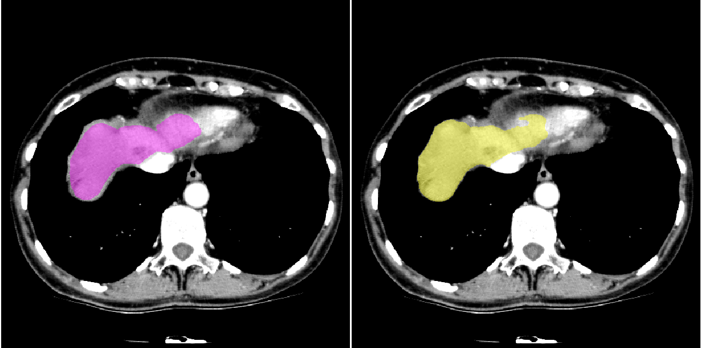
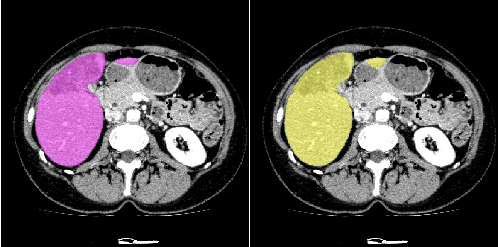
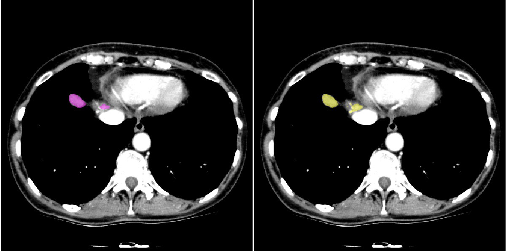
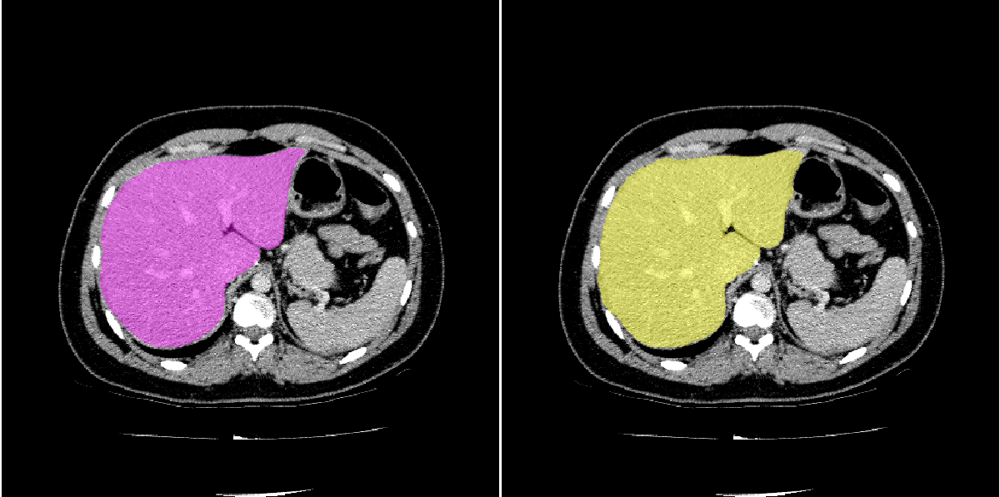

# Densenet_FCN
A tensorflow implementation of densenet with FCN for liver segmentation.

## Step by step configuration

All the basic configurations of model and training process are listed in `config.py` and managed by `EasyDict`. We define our config parameters as `__C` which is defined in `config.py`. 

**Note:** All the configs maybe reset in an extra file `./config/dice_skipv2.yml` and it will cover the configs in `config.py`. We recommend to write a new `.yml` file for your own configuration instead of modifying `config.py`.

### 1. Prepare Dataset

* Dataset root directory is set as `__C.DATA.ROOT_DIR`. You can specify root path both in windows or linux and the code will identify automatically.

* Then `__C.DATA.TRAINSET`, `__C.DATA.TESTSET` and `__C.DATA.VALSET` should be set as related directories of dataset. Here an example of directory tree is showed below. `liver` directory save all the 2D liver slices while `mask` directory save all the 2D mask slices.

```
./data
├─Liver_2017_train
│  ├─liver
│  └─mask
├─Liver_2017_val
│  ├─liver
│  └─mask
├─Liver_2017_test
│  ├─liver
│  └─mask
├─Liver_2017_test_3D
│  ├─liver
│  └─mask
```

* All the liver and mask data is `.mhd` + `.raw` format.

* Set correct window width and level in `__C.IMG.W_WIDTH` and `__C.IMG.W_LEVEL`. 

### 2. Train/Validation/Test and Model parameters

* Please set `__C.TAG` a specify string to identify current model.

* If `__C.PRED_TAG` is not empty, then the segmentation results will be stored.

* `__C.TRAIN.MAX_ITERS`: Total steps

* `__C.MODEL` contains all the `FC-Densenet` parameters such as *growth rate*, *compression rate*.

* `__C.BACKBONE`: We also implement [U-Net](https://arxiv.org/abs/1505.04597) and [Tiramisu](https://arxiv.org/abs/1611.09326) which can also be used as backbone. **You can add your own network by inherit `class Network` which is defined in `networks.py`.**

* Other parameters please reference the description in `config.py`.

### 3. Train

Run the command below to train your model. This code will save the best weights(for validation) during training and the lastest weights. And `dice_skipv2` means the specific config file defined in `./config/`. `0` is the GPU ID you want to use. Only single GPU is supported.

```bash
bash main.sh train 0 dice_skipv2
```

### 4. Test

Run the command below to test your model in 2D mode with the best model.

```bash
bash main.sh test 0 dice_skipv2 2D true
```

Run the command below to test your model in 3D mode with the lastest model. 3D mode means that run 2D slices and concat them to 3D.

```bash
bash main.sh test 0 dice_skipv2 3D false
```

### 5. Metrics

We implement dice metric and other 5 metrics for evaluating segmentation accuracy. [Reference](https://ieeexplore.ieee.org/abstract/document/4781564/)

* Dice coefficient

* VOE

* VD

* ASD

* RMSD

* MSD

## Results

Example of public dataset [3D-Ircadb 01](https://www.ircad.fr/research/3d-ircadb-01/). Left part is label, right part is prediction.

|Liver-heart weak boundary|Isolated region|
|:-----------------------:|:-------------:|
|||

|Small region|Gap|
|:-----------------------:|:-------------:|
|||


## Save/Load Model and Prediction

### 1. Freeze model

Maybe you want to freeze model with different batch size. You can set `__C.TEST.SAVE_MODEL` as `true` just like `./config/dice_skipv2_deploy.yml` and change `__C.TEST.BS_2D` to other number. Then execute test routine:

```bash
bash main.sh test 0 dice_skipv2_deploy 2D true
```

it will save an empty model with new batch size. Then you will get three new file:

```
deploy_default_best.ckpt.data-00000-of-00001
deploy_default_best.ckpt.index
deploy_default_best.ckpt.meta
```

Of course we just need meta graph with new batch size `deploy_default_best.ckpt.meta`. Copy and replace the other two file with real weights:

```bash
cp default_best.ckpt.data-00000-of-00001 deploy_default_best.ckpt.data-00000-of-00001
cp default_best.ckpt.index deploy_default_best.ckpt.index
```

Then we can freeze model `deploy_default_best.ckpt` to `deploy_default_best.pb`. First change the first `if` to `True` in the `__main__` part of `./utils/Model_Kits.py`, then execute 

```bash
CUDA_VISIBLE_DEVICES=0 python ./utils/Model_Kits.py --model dice_skipv2 --prefix deploy_default
```

Note that `--model` argument denote the model tag `__C.TAG` while `--prefix` argument denote the model prefix `__C.PREFIX`. Re-generated model has a prefix `deploy_xxxx`.

### 2. Load Model and Predict in Python

Change the first `if` to `False` and the second `if` to `True` in the `__main__` part of `./utils/Model_Kits.py`, then execute 

```bash
CUDA_VISIBLE_DEVICES=0 python ./utils/Model_Kits.py
```

For details please read the `segmentation()` function in `./utils/Model_Kits.py`.

### 3. Load Model and Predict in C++

Please make sure you have compile the tensorflow C++ API from source. 

Create a new project `demo` and add `load_graph.cpp` to project, add include files, `tensorflow.lib` to VS configuration and add `tensorflow.dll` to environment variable `PATH`. Then compile and run 

```bash
demo.exe path/to/xxx.pb xxx.raw1 xxx.raw2 ...
```